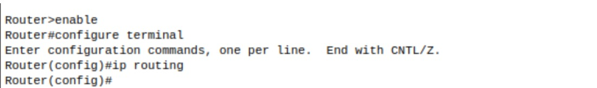
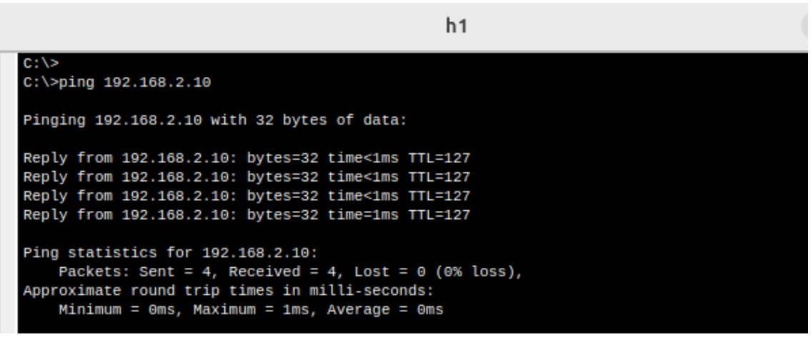
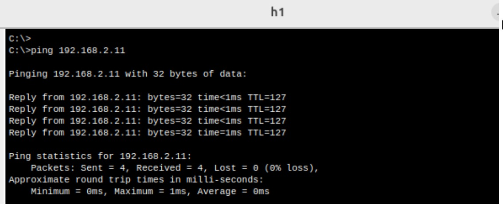
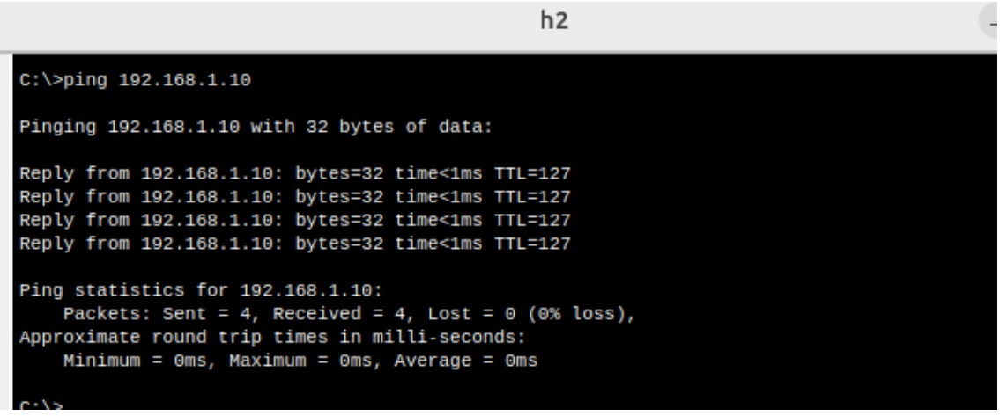
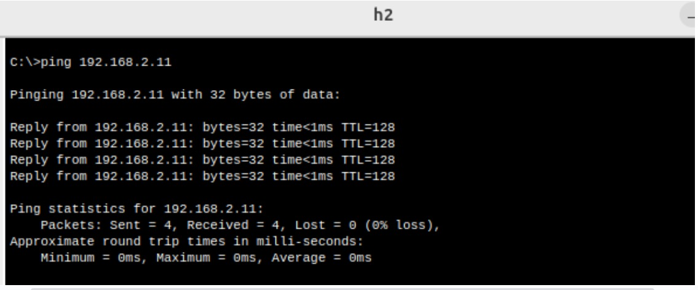
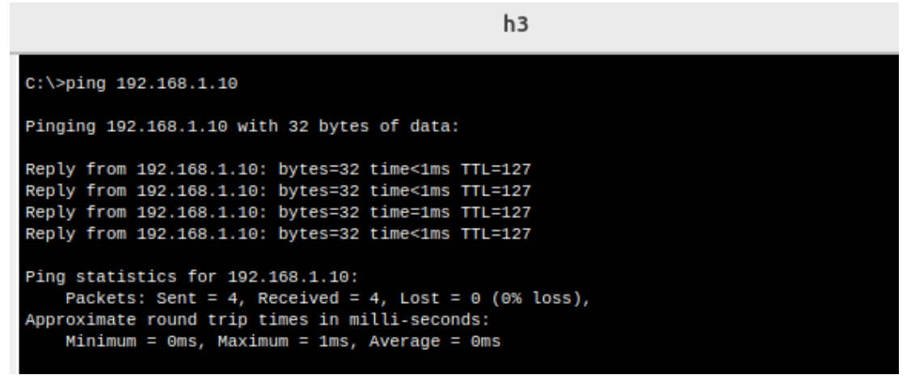

# Parte I - Configuración y Análisis de tráfico IPv4/IPv6
**Integrantes**  
- Gaston Fernandez
- Maria Lujan Guimpelevich
- David Trujillo
- Milagros Venecia
- Karen Yesica Robles

**Nombre del grupo**
 "Taylor Switch"

**Universidad Nacional de Cordoba - FCEFyN**  

**Cátedra de Redes de computadoras**

 **17 de Marzo 2025**  

---
# Consignas

## 1- Marco Teórico

**Dual Stack**  

El término dual stack se refiere a la implementación simultánea de los protocolos IPv4 e IPv6 en una misma infraestructura de red. Esto permite la coexistencia de ambos protocolos, facilitando la transición hacia IPv6 sin perder compatibilidad con dispositivos o servicios que aún operan con IPv4.

El dual stack se logra configurando interfaces de red para que soporten ambas pilas de protocolo, asignando una dirección IPv4 y una dirección IPv6 a cada interfaz. De esta manera, las aplicaciones pueden usar cualquiera de los dos protocolos según lo requieran.

**Protocolos de Comunicación (ARP,NDP e ICMP)** 

- **ARP (Address Resolution Protocol):** Es un protocolo de la capa de red utilizado para resolver direcciones IP en direcciones MAC en redes IPv4. Cuando un dispositivo desea comunicarse con otro en la misma red local, utiliza ARP para descubrir la dirección física asociada a una dirección IP.

- **NDP (Neighbor Discovery Protocol):** Es el protocolo equivalente a ARP en redes IPv6. Además de la resolución de direcciones, NDP realiza tareas adicionales, como la autoconfiguración de direcciones y la detección de duplicados. Utiliza mensajes ICMPv6 para intercambiar información entre dispositivos.

- **ICMP (Internet Control Message Protocol):** Es un protocolo de diagnóstico y control utilizado tanto en IPv4 como en IPv6. Permite la notificación de errores y el envío de mensajes de control, como en el caso de los comandos ping y traceroute. En IPv6, ICMP también incluye funcionalidades adicionales a través de ICMPv6.

**Asignación de Direcciones IP (DHCP)** 

El *Dynamic Host Configuration Protocol (DHCP)* es un protocolo utilizado para asignar direcciones IP de manera dinámica a los dispositivos en una red. En el contexto de dual stack, pueden coexistir dos servicios DHCP:

- **DHCPv4:** Asigna direcciones IPv4 a dispositivos que utilizan este protocolo.

- **DHCPv6:** Realiza la asignación automática de direcciones IPv6, así como otros parámetros de configuración.

**Asignación de Direcciones IP (DHCP)** 

El enrutamiento en redes dual stack implica la coexistencia de rutas IPv4 e IPv6 en los dispositivos de red. Los routers configurados para dual stack manejan ambas pilas simultáneamente, realizando encaminamiento según el tipo de dirección de destino. Para garantizar la conectividad, los routers mantienen tablas de enrutamiento separadas para cada protocolo.

La correcta configuración y monitoreo de las rutas es fundamental para evitar conflictos y asegurar el rendimiento de la red en un entorno híbrido.

## 2-
**Diagrama de red propuesto:**

**Tabla de asignación de direcciones propuestas:**

Para configurar las direcciones IPv4 de los host se ingresó al escritorio de cada uno, y se configuró manualmente al utilizar la aplicación “IP Configuration”. A continuación, se muestra las configuraciones:

  
  
  

La configuracion del router se realizó de la siguiente manera:

Mediante el comando ping, se envían paquetes de tipo ICMP y se prueba la conectividad entre los dispositivos los cuales funcionan correctamente:

## 3- 

En el contexto de redes, los términos simulador y emulador se refieren a herramientas que permiten la creación y evaluación de topologías de red, pero difieren en su enfoque y grado de realismo.

- *Simuladores:* Reproducen el comportamiento de los dispositivos de red mediante modelos abstractos. No ejecutan el software real de los dispositivos, sino que **imitan** su funcionamiento. Ejemplos de simuladores son Packet Tracer y NS-3. Son ideales para estudiar conceptos teóricos y realizar prácticas educativas, ya que proporcionan un entorno controlado y sencillo de utilizar.

- *Emuladores:* Ejecutan el software real de los dispositivos de red, proporcionando un entorno muy similar al de una red física. Esto permite probar configuraciones reales y diagnosticar problemas de forma más precisa. Ejemplos de emuladores son GNS3 y CORE.

La principal diferencia radica en el nivel de realismo y precisión. Los simuladores son más ligeros y fáciles de usar, pero menos precisos, mientras que los emuladores ofrecen una experiencia cercana a la realidad, aunque requieren más recursos computacionales.
## 4-
Ping desde h1 a h2

Habilitar router

h1 a h3

h2 a h1

h2 a h3

h3 a h1

h3 a h2

## 5-
## 6-
Iniciar tráfico ICMP en el Cliente 1 con destino Cliente 2. Analizar tráfico sobre las dos redes, capturar screenshots y responder las siguientes preguntas:

Iniciando el tráfico entre h1 y h2
6_1

**a-**   
Cuando un dispositivo necesita comunicarse con otro en la misma red, pero no conoce su dirección MAC, envía una solicitud ARP (**ARP Request**) para averiguarla. El dispositivo destino responde con un **ARP Reply.**

Al iniciar un ping desde **H1 (192.168.1.10)** hacia **H2 (192.168.2.10)**, se pueden observar diferentes tipos de tráfico:

- H1 necesitará enviar el paquete al router porque H2 está en otra red.
- Si H1 no conoce la MAC del router (192.168.1.11), enviará una solicitud ARP al router para obtener su dirección MAC.
- El router responderá con un ARP Reply.
- Una vez que H1 conoce la dirección MAC del router, enviará el paquete ICMP al router, que se encargará de reenviarlo a H2.

6_2

**b-**

6_3

Las direcciones IP son:
	Source: 192.168.1.10 (h1)
	Destination: 192.168.2.10 (h2)

6_4

	Source: 192.168.2.10 (h2)
	Destination: 192.168.1.10 (h1)

**c-**
El **router** usa su **tabla de enrutamiento** para decidir por qué interfaz reenviar un paquete.

- **H1 (192.168.1.10) quiere comunicarse con H2 (192.168.2.10).**
- **H1 nota que H2 está en otra red** y envía el paquete a su gateway (192.168.1.11, el router).
- **El router revisa su tabla de enrutamiento** y ve que *192.168.2.0/24* está en *GigabitEthernet0/0/1.*
- **El router reenvía el paquete a H2** a través de esa interfaz.

## 7-

