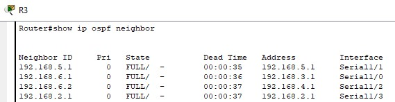
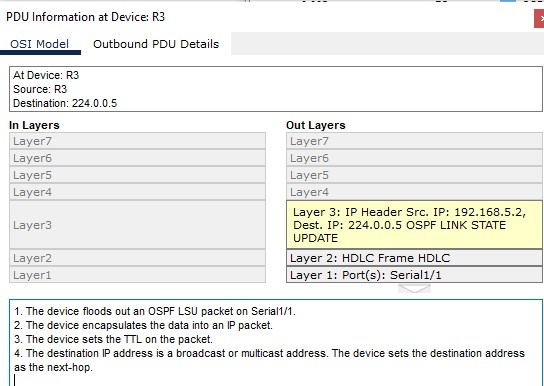

# Evaluación de performance en redes y ruteo interno dinámico Open Shortest Path First (OSPF)

### Integrantes

- Gastón E. Fernandez
- María L. Guimpelevich
- Karen Y. Robles
- David Trujillo
- Milagros A. Venecia

### Nombre del grupo

 "Taylor Switch"

### Universidad Nacional de Cordoba - FCEFyN

### Cátedra de Redes de computadoras

### Profesores

- Santiago M. Henn
- Facundo N. Oliva Cuneo

#### 10 de Abril 2025

#### Información de contacto

- gaston.fernandez@mi.unc.edu.ar
- lujan.guimpelevich@mi.unc.edu.ar
- yesica.robles@mi.unc.edu.ar
- d.trujillo@unc.edu.ar
- milagros.venecia@unc.edu.ar

---

## Desarrollo

## 1- 
* **OSPF (Open Shortest Path First):** Es un protocolo de enrutamiento dinámico de estado de enlace. Se utiliza para tomar decisiones de enrutamiento calculando la ruta más corta para enviar paquetes dentro de un Sistema Autónomo (AS). 

* **Clases de Redes:** Las direcciones IP se dividen en clases (A, B, C, D y E) que determinan el tamaño de la red y el número de hosts que puede contener. Las clases A, B y C son las más comunes para asignar direcciones a los hosts. 

* **Algoritmos de Shortest Path:** Son algoritmos que calculan la ruta más corta entre dos puntos en una red. El algoritmo de Dijkstra es uno de los más utilizados por OSPF para encontrar la ruta más corta a través de un AS.

* **Teoría de Grafos y Redes OSPF:** La teoría de grafos se aplica a las redes al representar los dispositivos de red (routers, switches, hosts) como nodos y las conexiones entre ellos como aristas. OSPF utiliza esta representación para construir un mapa de la topología de la red y calcular las rutas más cortas. 


## 2-
<p align="center">
<br>
 <span><i>Imagen 1.Topologia de red</i></span>
</p>
Para diseñar el esquema de direccionamiento IP, se segmenta una red clase A o B para los hosts y se utiliza una red clase C para las conexiones entre routers.

* **Red Clase A para los Hosts h1,h2,h3:** 10.0.0.0 255.255.255.0
* **Red Clase B para los Hosts h4:** 172.18.0.0 255.255.255.0 
* **Red Clase B para los Hosts h5:** 172.19.0.0 255.255.255.0 
* **Redes Clase C para Enlaces entre Routers:**
    * R1-R2: 192.168.1.0 255.255.255.0
    * R2-R3: 192.168.5.0 255.255.255.0
    * R3-R4: 192.168.3.0 255.255.255.0
    * R4-R5: 192.168.6.0 255.255.255.0
    

**Tabla de Direccionamiento:**

| Red/Segmento           | Red Base       | Máscara             | Rango Utilizable           | Dispositivo (Interfaz especificada) | IP Asignada    | Gateway (Hosts)   |
|------------------------|----------------|----------------------|-----------------------------|--------------------------------------|----------------|-------------------|
| LAN h1, h2, h3 (S1)    | 10.0.0.0       | 255.255.255.0        | 10.0.0.1 - 10.0.0.254       | R2 (Fa0/0)                           | 10.0.0.1       | 10.0.0.1          |
| h1 (FastEthernet0)     |                |                      |                             | PC h1                                | 10.0.0.2      | 10.0.0.1          |
| h2 (FastEthernet0)     |                |                      |                             | PC h2                                | 10.0.0.3      | 10.0.0.1          |
| h3 (FastEthernet0)     |                |                      |                             | PC h3                                | 10.0.0.4      | 10.0.0.1          |
| h4 (R4)            | 172.18.0.0     | 255.255.255.0        | 172.18.0.1 - 172.18.0.254   | R4 (Fa0/0)                           | 172.18.0.2     | 172.18.0.1 |
| h5 (R5)            | 172.19.0.0     | 255.255.255.0        | 172.19.0.1 - 172.19.0.254   | R5 (Fa0/0)                           | 172.19.0.2     | 172.19.0.1        |
| Enlace R1 - R2         | 192.168.1.0    | 255.255.255.0        | 192.168.1.1 - 192.168.1.254 | R1 (Se1/0)                           | 192.168.1.2    | N/A               |
|                        |                |                      |                             | R2 (Se1/0)                           | 192.168.1.1    | N/A               |
| Enlace R1 - R3         | 192.168.2.0    | 255.255.255.0        | 192.168.2.1 - 192.168.2.254 | R1 (Se1/1)                           | 192.168.2.1    | N/A               |
|                        |                |                      |                             | R3 (Se1/3)                            | 192.168.2.2    | N/A               |
| Enlace R3 - R4         | 192.168.3.0    | 255.255.255.0        | 192.168.3.1 - 192.168.3.254 | R3 (Se1/0)                            | 192.168.3.2    | N/A               |
|                        |                |                      |                             | R4 (Se1/1)                            | 192.168.3.1    | N/A               |
| Enlace R2 - R3         | 192.168.5.0    | 255.255.255.0        | 192.168.5.1 - 192.168.5.254 | R2 (Se1/1)                            | 192.168.5.1    | N/A               |
|                        |                |                      |                             | R3 (Se1/1)                            | 192.168.5.2    | N/A               |
| Enlace R3 - R5         | 192.168.4.0    | 255.255.255.0        | 192.168.4.1 - 192.168.4.254 | R3 (Se1/2)                            | 192.168.4.2    | N/A               |
|                        |                |                      |                             | R5 (Se1/0)                            | 192.168.4.1    | N/A               |
| Enlace R4 - R5         | 192.168.6.0    | 255.255.255.0        | 192.168.6.1 - 192.168.6.254 | R4 (Se1/2)                           | 192.168.6.1    | N/A               |
|                        |                |                      |                             | R5 (Se1/1)                            | 192.168.6.2    | N/A               |
| Loopback  R1         | 	1.1.1.1               |   255.255.255.255                   |   1.1.1.1                          | R1 (Loopback0)                          | 	1.1.1.1    | N/A               |

## 3-
Cada router fue configurado con sus respectivas interfaces IP, tanto en los enlaces punto a punto como hacia las redes de hosts. Luego, se habilitó el protocolo OSPF utilizando el proceso número 1 (router ospf 1) y se asignaron todas las redes.

**Configuración del Router R2:**
 ```bash
enable
configure terminal


interface Serial1/0
ip address 192.168.1.1 255.255.255.0
no shutdown
exit

interface Serial1/1
ip address 192.168.5.1 255.255.255.0
no shutdown
exit

interface FastEthernet0/0
ip address 10.0.0.1 255.0.0.0
no shutdown
exit

router ospf 1
network 10.0.0.0 0.255.255.255 area 0
network 192.168.1.0 0.0.0.255 area 0
network 192.168.5.0 0.0.0.255 area 0

```
Lo mismo se realiza con los demás routers. En particular, en el router R1 es necesario configurar una interfaz de loopback. Esto se hace de la misma forma que con las demás interfaces, especificando el nombre de interfaz como Loopback0

```bash
enable
configure terminal

interface Loopback0
ip address 1.1.1.1 255.255.255.255
no shutdown
```

Se utilizó `show ip ospf neighbor` para verificar el establecimiento de relaciones de vecinos OSPF entre routers directamente conectados.

 
 
 
 
 
 
Se realizaron pruebas de ping entre hosts y routers, confirmando la propagación de rutas y la correcta conectividad extremo a extremo.


Luego se consultó la tabla de enrutamiento con ` show ip route ` , observando entradas con la letra "O", que indican rutas aprendidas dinámicamente por OSPF


## 4-
Con el objetivo de comprender en profundidad el funcionamiento del protocolo OSPF (Open Shortest Path First) y su impacto en la dinámica de la red, se llevó a cabo un análisis detallado de los mensajes intercambiados entre routers. OSPF es un protocolo de enrutamiento de estado de enlace que utiliza cinco tipos principales de paquetes para establecer, mantener y actualizar la topología de la red: Hello, Database Description (DBD), Link-State Request (LSR), Link-State Update (LSU) y Link-State Acknowledgment (LSAck).

Para identificar y analizar estos mensajes en detalle, se utilizó el modo de simulación paso a paso, lo cual permitió observar de manera controlada y secuencial el proceso de establecimiento de adyacencias, el intercambio de información de estado de enlace y la actualización de las bases de datos de los routers:


Se observó especialmente el intercambio de paquetes Hello, fundamentales para establecer y mantener las adyacencias entre routers que utilizan el protocolo OSPF (Open Shortest Path First). Estos paquetes permiten detectar vecinos en la misma red, verificar la compatibilidad de parámetros (como el intervalo de Hello, Dead interval, ID de router, etc.) y mantener activa la relación de vecindad.


Además, se visualizaron los paquetes Link-State Update (LSU), que contienen información sobre los cambios en el estado de los enlaces dentro de la red. Esta información es crítica para mantener actualizadas las bases de datos de estado de enlace (LSDB, Link-State Database) en todos los routers del área OSPF. Cada LSU puede incluir múltiples Link-State Advertisements (LSA), los cuales describen el estado y las conexiones de un router.



Para asegurar una comunicación confiable, también se observó el envío de paquetes Link-State Acknowledgment (LSAck). Estos se utilizan para confirmar la recepción correcta de los LSUs, ya que OSPF, aunque es un protocolo confiable en cuanto a consistencia de base de datos, se basa en IP, un protocolo no confiable. Por ello, el acuse de recibo garantiza que los LSAs no se pierdan durante la transmisión.


Gracias al intercambio de estos mensajes —Hello, LSU y LSAck—, los routers pueden construir una LSDB coherente y sincronizada en toda el área OSPF. A partir de esta base de datos, cada router ejecuta el algoritmo de Dijkstra (también conocido como algoritmo SPF, Shortest Path First) para calcular las rutas óptimas hacia cada destino en la red.

## 5-
## a)
En cada router se configuró el protocolo OSPF (Open Shortest Path First) para anunciar sus redes directamente conectadas. Esto se realizó mediante el uso del comando `network ` dentro del proceso OSPF correspondiente. Gracias a esta configuración, los routers pueden intercambiar información sobre sus enlaces con el resto de los dispositivos de la red, lo que permite la construcción automática de rutas dinámicas y optimizadas. Además, OSPF garantiza una rápida convergencia ante cambios en la topología y mejora la escalabilidad de la red.


## b)
Se utilizó el comando `show ip ospf database` en cada router para acceder al contenido de la Link-State Database (LSDB). Esta base de datos contiene información detallada sobre todos los routers y redes conocidas dentro del área OSPF a la que pertenece el dispositivo. Gracias a esta información, cada router puede construir un mapa topológico completo de su área y calcular la ruta más eficiente hacia cada destino utilizando el algoritmo de Dijkstra.
A continuación, se presentan los resultados observados antes de definir múltiples áreas OSPF en los routers A y B, cuando todos los dispositivos aún formaban parte de una única área (generalmente el área por defecto, área 0)


| Campo       | Significado                                                                                                                                                    |
|-------------|-----------------------------------------------------------------------------------------------------------------------------------------------------------------|
| Link ID     | Identificador del router o red anunciada. En los Router Link States, suele coincidir con el Router ID del router que generó esa LSA.                           |
| ADV Router  | (Advertising Router) ID del router que generó la LSA. Puede coincidir con el Link ID o ser distinto si es una red.                                             |
| Age         | Tiempo (en segundos) desde que se originó o recibió la LSA. Cuando llega a 1800 segundos (30 minutos), se considera "vieja" y debe actualizarse.               |
| Seq#        | (Sequence Number) Número de secuencia que identifica la versión de la LSA. OSPF usa esto para saber si una LSA es más reciente que otra.                       |
| Checksum    | Verificación de integridad de la LSA. Sirve para detectar errores en la transmisión de la base de datos.                                                       |
| Link count  | Cantidad de enlaces (links) que el router tiene, es decir, cuántas interfaces OSPF activas anuncia. Aplica solo a LSAs de tipo Router.                         |

## 6-
Inicialmente, toda la red estaba configurada dentro del área 0 de OSPF, siguiendo el esquema backbone tradicional. Sin embargo, el nuevo requerimiento consiste en dividir la red en dos áreas específicas para optimizar el enrutamiento y segmentar la topología de la siguiente manera:

Área A (Área 1): Incluye a los routers R1 y R2.

Área B (Área 2): Incluye a los routers R3, R4 y R5.

Para lograr esto, se procedió a realizar los siguientes cambios:

Configuración de Routers:

* R1:

Se reclasificaron todas sus interfaces (incluida la Loopback 1.1.1.1) al Área 1.

Se eliminó la asignación previa al Área 0.
```bash
conf t
router ospf 1
no network 1.1.1.1 0.0.0.0 area 0
no network 192.168.1.0 0.0.0.255 area 0
no network 192.168.2.0 0.0.0.255 area 0
network 1.1.1.1 0.0.0.0 area 1
network 192.168.1.0 0.0.0.255 area 1
network 192.168.2.0 0.0.0.255 area 1
area 1 virtual-link 2.2.2.2
exit
```

* R2:

Actúa como ABR (Area Border Router), manteniendo conexión entre el Área 1 (LAN interna y conexión a R1) y el Área 0 (hacia R3).

Las interfaces hacia la LAN se configuraron en Área 1 y la conexión de backbone se dejó en Área 0.
```bash
conf t
router ospf 1
no network 192.168.1.0 0.0.0.255 area 0
no network 192.168.5.0 0.0.0.255 area 0
no network 10.0.0.0 0.0.0.255 area 0
network 192.168.1.0 0.0.0.255 area 1
network 10.0.0.0 0.0.0.255 area 1
network 192.168.5.0 0.0.0.255 area 0
area 1 virtual-link 1.1.1.1
```
* R3:

También se desempeña como ABR, conectando el Área 0 (hacia R2) con el Área 2 (hacia R4 y R5).
```bash
conf t
router ospf 1
no network 192.168.3.0 0.0.0.255 area 0
no network 192.168.4.0 0.0.0.255 area 0
no network 192.168.5.0 0.0.0.255 area 0
network 192.168.5.0 0.0.0.255 area 0
network 192.168.3.0 0.0.0.255 area 2
network 192.168.4.0 0.0.0.255 area 2
```
* R4 y R5:

Ambos routers se configuraron completamente dentro del Área 2.
```bash
conf t
router ospf 1
no network 192.168.3.0 0.0.0.255 area 0
no network 192.168.6.0 0.0.0.255 area 0
no network 172.18.0.0 0.0.0.255 area 0
network 192.168.3.0 0.0.0.255 area 2
network 192.168.6.0 0.0.0.255 area 2
network 172.18.0.0 0.0.0.255 area 2
```
```bash
conf t
router ospf 1
no network 192.168.4.0 0.0.0.255 area 0
no network 172.19.0.0 0.0.0.255 area 0
network 192.168.4.0 0.0.0.255 area 2
network 172.19.0.0 0.0.0.255 area 2
exit
```

Para facilitar la identificación y administración de la red OSPF, se asignó manualmente un Router ID único a cada router.
Esto mejora la claridad en el monitoreo, la lectura de la base de datos LSDB y la resolución de problemas, evitando que el Router ID sea elegido automáticamente (lo cual podría causar confusión si cambia una IP).

El Router ID se configuró con el comando:
```bash
router ospf 1
router-id X.X.X.X
```
Donde X.X.X.X corresponde a un identificador único por router (por ejemplo, 1.1.1.1 para R1, 2.2.2.2 para R2, etc.).

Durante la reconfiguración, se detectó un error en R1:
```bash
%OSPF-4-ERRRCV: Received invalid packet: mismatch area ID, from backbone area must be virtual-link but not found
```
Este error ocurre porque OSPF requiere que todo router que forme parte de OSPF esté conectado lógica o físicamente al Área 0. Al haber movido R1 al Área 1, ya no existía una conexión directa al backbone, por lo que fue necesario configurar un enlace virtual (virtual-link) entre R1 y R2 para mantener la conectividad OSPF adecuada.

Por tal motivo se configuró un enlace virtual entre R1 y R2 sobre el Área 1, utilizando los Router ID de ambos dispositivos, asegurando así que R1 pudiera alcanzar el Área 0 a través de R2.


Para ver el estado de la base de datos de OSPF (LSDB, Link-State Database) en el router se utiliza el comando `show ip ospf database`


## 7-
## a)
Para visualizar los vecinos OSPF directamente conectados, se utilizó el siguiente comando en R2 `show ip ospf neighbor`, el cual muestra una lista de routers vecinos con los que R2 ha establecido adyacencias OSPF exitosas.


* Neighbor ID 1.1.1.1:
  * Corresponde al router R1.
  * Está conectado por Serial1/0 y también tiene un enlace a través de OSPF Virtual-Link (OSP_VL0), que se creó para mantener la conectividad al Área 0 (backbone).

* Neighbor ID 3.3.3.3:
  * Corresponde al router R3.
  * La conexión es directa por la interfaz Serial1/1.

* Estado FULL:
  * El estado "FULL" indica que se ha formado exitosamente una adyacencia completa con ambos routers vecinos. Es el estado óptimo en OSPF.

* Dead Time:
  * Se está recibiendo constantemente "Hello packets", ya que el contador se reinicia a 31 segundos, indicando buena comunicación.
  * R2 tiene adyacencias OSPF completamente funcionales con sus vecinos R1 y R3.
  * El enlace virtual (OSPF_VL0) entre R1 y R2 está operativo, lo que permite que R1 tenga acceso lógico al Área 0 como exige OSPF.

## b)
Para revisar el estado general del proceso OSPF y sus operaciones, se utilizaron los siguientes comandos en R2:

**1. Para ver información del proceso OSPF:**


* Router ID: 2.2.2.2
Es el identificador único de R2 en OSPF.
Nota: Este ID fue asignado manualmente para mejor identificación y administración de la red.

* Rol:
  * El router es un ABR (Area Border Router).
  *Esto significa que conecta Área 1 y Área 0 (Backbone), permitiendo el intercambio de rutas entre áreas.

* SPF Algorithm:
  * El algoritmo SPF (Shortest Path First) se ha ejecutado varias veces (9 en área 0 y 14 en área 1).
  * Esto indica que R2 ha recalculado rutas, ya sea por cambios de topología o configuraciones.

* Áreas que maneja:
  * Área BACKBONE (0):
     Tiene 1 interfaz activa en esta área.

  * Área 1:
    Tiene 2 interfaces activas.

* Número de LSA:
Se muestran diferentes tipos de LSAs (Link-State Advertisements) que ayudan a construir la topología de red.
No hay LSAs externos (Type 5), lo que es normal en una red interna sin rutas externas.

**2. Para ver rutas OSPF en la tabla de enrutamiento:**


La tabla muestra múltiples rutas aprendidas por OSPF:
* O → Ruta aprendida dentro del área (intra-área).
* O IA → Ruta aprendida de otra área (inter-área).

Entradas importantes:
* 1.1.1.1/32 → La loopback de R1 (vía 192.168.1.2).
* 172.18.0.0/16, 172.19.0.0/16 → Redes conectadas a R4 y R5, respectivamente.
* 192.168.2.0/24, 192.168.3.0/24, 192.168.4.0/24, 192.168.6.0/24 → Enlaces de interconexión de la topología.
* Via:
  * Todas las rutas indican que el siguiente salto (next hop) es uno de los vecinos R1 o R3, a través de las interfaces Serial1/0 y Serial1/1.
* [110/XX]:
  * 110 es el administrative distance de OSPF.
  * El valor luego de la barra (65, 129) es el costo OSPF de llegar a esa red.

## 8-
## a)
En OSPF, cada interfaz tiene un costo asociado que representa el "peso" del enlace. Este valor se utiliza para calcular la mejor ruta posible mediante el algoritmo de Dijkstra. Por defecto, el costo se determina en función del ancho de banda del enlace, pero puede ajustarse manualmente para influir en la selección de rutas.
En este caso, se modifica el costo de un enlace intermedio con el objetivo de observar cómo OSPF cambia la ruta seleccionada desde un origen (h1) hasta un destino (h4).
* h1 está conectado al router R2.
* h4 está conectado al router R4.

Existen dos posibles rutas entre R2 y R4:
* Ruta 1: R2 → R3 → R4
* Ruta 2: R2 → R3 → R5 → R4

Ambas rutas atraviesan tres routers, por lo tanto, la decisión de OSPF dependerá del costo total acumulado en cada trayecto.
Para forzar a OSPF a elegir la segunda ruta, se incrementa manualmente el costo del enlace R3–R4. Esta acción provoca que OSPF considere más eficiente la ruta alternativa: R2 → R3 → R5 → R4.


## b)
Para observar el impacto de la modificación de costos en la selección de rutas OSPF, se realizaron pruebas utilizando el comando `traceroute` desde el host h1 (conectado a R2) hacia el host h4 (conectado a R4), antes y después de alterar el costo de un enlace específico.
Antes de realizar cualquier cambio en la configuración de OSPF, se ejecutó un traceroute desde h1 hacia h4.


La salida muestra que OSPF elige la ruta más corta basada en el costo predeterminado de los enlaces, que corresponde al siguiente camino:
Ruta utilizada:
R2 → R3 → R4
Esto se debe a que, inicialmente, esta ruta tiene el menor costo acumulado según los valores por defecto establecidos por OSPF.
Después del cambio, se repitió la prueba con traceroute desde h1 a h4.


La salida evidencia un cambio en los saltos intermedios, lo que confirma que OSPF ha elegido una nueva ruta.
Nueva ruta utilizada:
R2 → R3 → R5 → R4
Este nuevo camino es preferido porque su costo acumulado es ahora menor que el de la ruta directa R3–R4, tras el aumento del costo en ese enlace.

## 9-
## a)
Se crea una interfaz de loopback en el router R1 para simular la conexión a un proveedor de servicios externo (ISP). Esta interfaz representa una red ficticia hacia Internet.


## b) 
Se configura una ruta estática predeterminada que indique que cualquier tráfico hacia una red desconocida debe enviarse por la interfaz simulada del ISP:


Esta ruta define que todos los destinos no específicos deben enviarse hacia esa dirección (la interfaz loopback0).


## c) 
Para que el resto de los routers en la red conozcan esta ruta predeterminada, se configura R1 para que la redistribuya a través de OSPF utilizando el comando `default-information originate`


Esto le indica a R1 que incluya la ruta 0.0.0.0/0 en sus actualizaciones OSPF, permitiendo que todos los demás routers la aprendan y puedan redirigir tráfico externo hacia él.

Se verificó la tabla de enrutamiento en los routers R2, R3, R4 y R5 para confirmar que efectivamente recibieron la ruta predeterminada redistribuida por el router R1 mediante OSPF.


Observaciones:
* O: La ruta fue aprendida mediante el protocolo OSPF.
* *: Es la ruta candidata como Gateway of Last Resort (Puerta de Enlace de Último Recurso).
* E2: Se trata de una ruta externa tipo 2. Esto significa que:

La métrica externa asignada (por defecto 1) no se incrementa al atravesar routers internos OSPF, a diferencia de las rutas E1.
Esta ruta predeterminada 0.0.0.0/0 permite que cualquier dispositivo de la red (por ejemplo, el host h4) pueda enviar tráfico hacia destinos desconocidos — es decir, IP fuera del dominio OSPF o de su tabla de rutas.
Ese tráfico será encaminado automáticamente hacia el siguiente salto hacia R1, quien actúa como puerta de enlace hacia el exterior (simulada con la interfaz Loopback0).

## 10- 
El router R2 cumple un rol importante como nodo intermedio en la topología, ya que se encuentra conectado a varios routers y dispositivos de la red. Si una de sus interfaces cae, el impacto dependerá de cuál de ellas sea:
a) Caída del enlace R2 – R1
* Esta interfaz probablemente forma parte del backbone o del área principal (Área 0) del protocolo OSPF.
* Si se interrumpe, se perderá la conectividad directa entre R2 y R1.
* El enrutamiento OSPF detectará la caída mediante los Hello/Dead intervals (~40 segundos por defecto) y actualizará las tablas de ruteo en toda la red.
* Si existen rutas alternativas (por ejemplo, vía R3 o R5), OSPF recalculará el mejor camino usando el algoritmo de Dijkstra y restablecerá la conectividad.
* Sin embargo, si R1 solo estaba accesible por R2, se perdería la salida hacia la ruta por defecto o hacia el ISP simulado.

b) Caída del enlace R2 – R3
* Esta caída afecta directamente una de las rutas disponibles entre R2 y R4 (recordando que existían dos rutas posibles: vía R3 o vía R5).
* OSPF eliminará esta ruta al detectar que el enlace ya no está disponible y utilizará automáticamente la ruta alternativa, siempre que los costos lo permitan.
* El tráfico puede redirigirse por otro camino como R2 → R5 → R4, manteniendo la conectividad.

c) Caída del enlace R2 – S1 (Switch o PC conectado)
* Este enlace generalmente conecta R2 con dispositivos finales como hosts (por ejemplo, h1) o conmutadores.
* Si se cae esta interfaz, los dispositivos conectados directamente a R2 (como PCs) perderán la conectividad hacia el resto de la red.
* Este impacto es local, es decir, no afecta a otros routers OSPF, pero impide que el host envíe o reciba paquetes más allá de R2.


## 11- 
**RIB – Routing Information Base**
* Es la tabla de enrutamiento tradicional, que almacena todas las rutas aprendidas por protocolos dinámicos (OSPF, RIP, EIGRP), rutas estáticas y rutas conectadas directamente.
* El router utiliza esta base de datos para determinar cuál es la mejor ruta hacia cada red, basándose en métrica y prioridades.
* Se puede visualizar con el comando: `show ip route` 

**FIB – Forwarding Information Base**
* Es la tabla utilizada por CEF (Cisco Express Forwarding) para reenviar paquetes de forma eficiente.
* Contiene solo las mejores rutas ya seleccionadas por la RIB, pero está optimizada para un reenvío rápido de paquetes.
* Incluye información detallada como la interfaz de salida y el próximo salto.
* Se puede visualizar con el comando:  `show ip cef `


* 1. Ruta por defecto (default route) `0.0.0.0/0            192.168.5.1`
Esto indica que todo el tráfico que no tenga una ruta específica será enviado al siguiente salto 192.168.5.1. Es tu gateway of last resort (salida hacia internet o redes desconocidas).

* 2. Redes directamente conectadas `192.168.2.0/24       attached             Serial1/3`
Significa que esa red está directamente conectada al router a través de la interfaz Serial1/3.

Las líneas: `192.168.2.2/32       receive`
Indican direcciones IP que pertenecen a este router. Es decir, si llega un paquete a esa IP, el router lo procesa localmente, no lo reenvía.

* 3. Rutas aprendidas por OSPF o estáticas
`172.19.0.0/16        192.168.4.1`
Esto significa que para alcanzar esa red, el router enviará los paquetes al siguiente salto 192.168.4.1, probablemente aprendido por OSPF o una ruta estática.

* 4. Redes multicast y especiales
`224.0.0.0/4          drop`
`224.0.0.0/24         receive`
Las direcciones multicast no se reenvían por defecto, por eso se indica drop. Pero ciertos rangos (224.0.0.0/24) son usados por protocolos internos como OSPF y son aceptados (receive).


