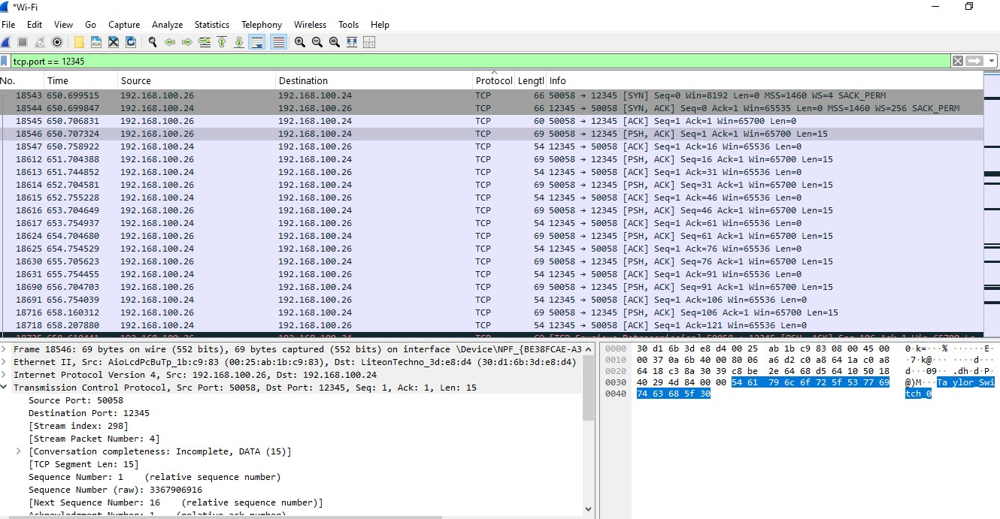
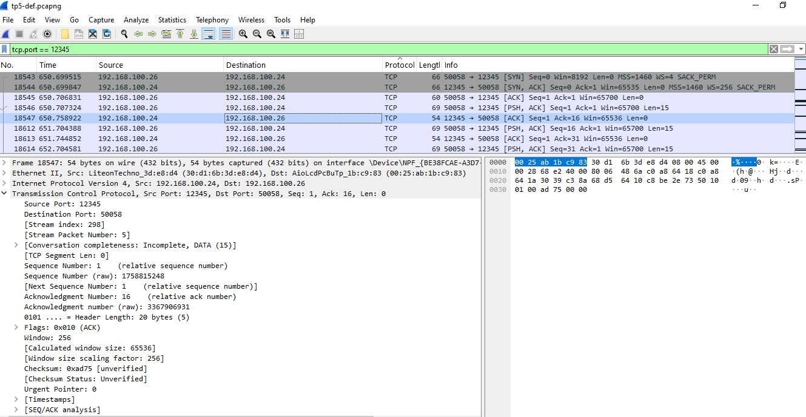
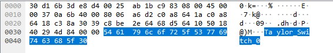
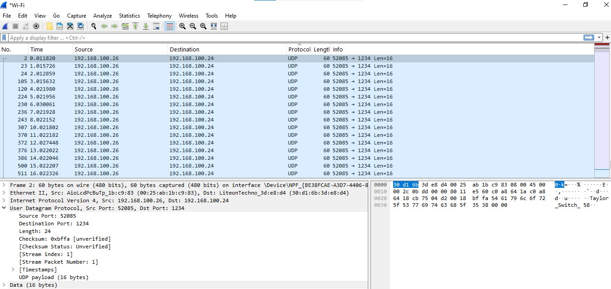
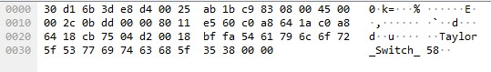

# Laboratorio N°5
## Networking Y Capa de Transporte en Sistemas Encriptados.

### Integrantes

- Gastón E. Fernández
- María L. Guimpelevich
- Karen Y. Robles
- David Trujillo
- Milagros A. Venecia

### Nombre del grupo

 "Taylor Switch"

### Universidad Nacional de Córdoba - FCEFyN

### Cátedra de Redes de computadoras

### Profesores

- Santiago M. Henn
- Facundo N. Oliva Cuneo

#### Información de contacto

- gaston.fernandez@mi.unc.edu.ar
- lujan.guimpelevich@mi.unc.edu.ar
- yesica.robles@mi.unc.edu.ar
- d.trujillo@unc.edu.ar
- milagros.venecia@unc.edu.ar

---

# Desarrollo
## Scripts Python para envío y recepción de paquetes por TCP
## 1.a) Envío y recepción de paquetes TCP

Se desarrollaron dos scripts en Python, uno actuando como cliente y otro como servidor, que permiten enviar y recibir paquetes de datos utilizando el protocolo TCP (default) o UDP.
  Ambos scripts debe ser ejecutados como:
  
```bash
    python3 -u ./server.py # Este debe ejecutarse primero. 
    # Para ver sus opciones, ejecutar con '-h | --help'
```
Y luego el cliente:
    
```bash
    python3 -u ./client.py
    # Para ver sus opciones, ejecutar con '-h | --help'
```

El cliente envía mensajes identificatorios del tipo `Taylor_Switch_XX`, donde `XX` representa un número incremental.
El servidor escucha en un puerto determinado y registra los mensajes recibidos.

El envío se realiza a intervalos configurables (por defecto 1 segundo) y se implementó una opción para alternar entre TCP y UDP mediante argumento de línea de comandos.

Se ejecutaron los scripts cliente y servidor utilizando el protocolo TCP sobre el puerto 12345. El cliente envió paquetes con identificadores únicos cada 1 segundo, mientras que el servidor los recibió y registró.

Para verificar el correcto tránsito de los paquetes, se utilizó Wireshark sobre la interfaz de red Wi-Fi. Se aplicó el filtro:

```bash
tcp.port == 12345
```



y se capturó la comunicación entre las direcciones IP 192.168.100.26 (cliente) y 192.168.100.24 (servidor).

En la Figura se muestra un paquete TCP seleccionado. En la parte inferior del panel, se observa claramente el contenido del paquete:

```bash
Taylor_Switch_0
```
Este contenido aparece en la sección "Data" del paquete, lo cual indica que la transmisión fue exitosa y el mensaje llegó intacto al destino.

Confirmación de recepción por parte del servidor:



Luego de recibir el paquete TCP con el contenido "Taylor_Switch_0", el servidor responde con un segmento TCP ACK dirigido al cliente.

En la Figura se muestra dicho paquete, donde se observa que:
- La IP origen es 192.168.100.24 (servidor).
- La IP destino es 192.168.100.26 (cliente).
- El puerto origen es 12345 (puerto del servidor).
- El paquete tiene longitud 0 en su carga útil (solo es un ACK).
- El flag ACK está activado, confirmando que el mensaje fue recibido correctamente.

Este comportamiento es consistente con el protocolo TCP, donde cada segmento de datos enviado debe ser confirmado con un paquete ACK desde el receptor.

Carga útil del paquete TCP con el mensaje Taylor_Switch_0:



Se muestra en detalle la carga útil del paquete TCP, destacando los bytes transmitidos como parte del mensaje.

La cadena Taylor_Switch_0 aparece codificada en ASCII en la parte inferior derecha de la vista hexadecimal.

Esta carga útil corresponde al identificador generado por el cliente y enviado al servidor a través del puerto TCP 12345.

La porción seleccionada incluye los siguientes bytes:
```bash
54 61 79 6c 6f 72 5f 53 77 69 74 63 68 5f 30
```
que, en ASCII, representan exactamente:
```bash
T  a  y  l  o  r  _  S  w  i  t  c  h  _  0
```
Esto confirma que los paquetes no solo están siendo transmitidos correctamente, sino que la información transportada puede ser interpretada sin errores desde el análisis de red.

## 1.b) Log de paquetes con timestamp
Ambos scripts registran los eventos de envío y recepción de paquetes en un archivo de log (log.txt). Cada línea contiene:
- El tipo de evento (SENT o RECEIVED),
- El contenido del mensaje,
- El timestamp de envío o recepción,
- El protocolo usado.

Ejemplo de log:
```bash
SENT Taylor_Switch_0 at 1749698804.4373617 - Protocol: tcp
RECEIVED Taylor_Switch_0 at 1749698804.4388385 - Protocol: tcp
```

Esto permite realizar un posterior análisis temporal de los mensajes intercambiados.

Código relevante:

```bash
def log_packet(data: str, timestamp: float, protocol: str) -> None:
    with open(LOG_FILE, "a") as f:
        f.write(f"SENT {data} at {timestamp} - Protocol: {protocol}\n")
```
## 1.c): Métricas de la conexión TCP
Se analiza el rendimiento de la comunicación TCP calculando:
- Latencia promedio
- Latencia mínima y máxima
- Jitter
Para ello se utilizaron los timestamps registrados en log.txt, tanto del cliente (envíos) como del servidor (recepciones).

Se desarrolló un script en Python que:

- Parsea el archivo de log buscando líneas con estructura:
```bash
SENT Taylor_Switch_0 at 1749698804.4373617 - Protocol: tcp
RECEIVED Taylor_Switch_0 at 1749698804.4388385 - Protocol: tcp
```

- Agrupa por protocolo y ID de mensaje.

- Calcula la latencia como la diferencia entre received - sent.

- Calcula el jitter como el promedio de las diferencias absolutas entre latencias consecutivas.

Fragmento clave del script:
```bash
latency = times["received"] - times["sent"]
jitter_values = [
    abs(latencies[i] - latencies[i - 1]) for i in range(1, len(latencies))
]
avg_jitter = sum(jitter_values) / len(jitter_values)
```

 ```bash
  python3 -u ./analyze.py 'log.txt'
 ```
        Métricas para TCP: 
            Muestras: 100
            Latencia promedio: 0.100 ms
            Latencia mínima: 0.054 ms
            Latencia máxima: 0.456 ms
            Jitter: 0.004 ms

## Scripts Python para envío y recepción de paquetes por UDP
## 2.a) Envío y recepción de paquetes UDP
Para verificar el correcto funcionamiento de la comunicación bajo el protocolo UDP, se ejecutaron los scripts client.py y server.py utilizando --protocol udp.

La herramienta Wireshark fue utilizada para capturar los paquetes. Se aplicó el filtro:

 ```bash
udp.port == 1234
 ```




Se observó tráfico proveniente del cliente (192.168.100.26) hacia el servidor (192.168.100.24) a través del puerto 1234.

En la Figura  se muestra un paquete UDP capturado, el cual contiene en su payload la cadena:

 ```bash
Taylor_Switch_58
 ```
En la sección de datos del paquete, se observa el siguiente contenido en ASCII:

```bash
54 61 79 6c 6f 72 5f 53 77 69 74 63 68 5f 35 38
T  a  y  l  o  r  _  S  w  i  t  c  h  _  5  8
```
Esto confirma que el mensaje enviado por el cliente llegó íntegro y sin modificación al servidor usando UDP, demostrando el funcionamiento básico de la transmisión sin conexión.
## 2.b) Log de paquetes con timestamp 
Al igual que en la implementación para TCP, los scripts cliente y servidor fueron adaptados para registrar los eventos de envío y recepción de paquetes UDP en el archivo log.txt.

Cada línea del log incluye:
- El tipo de evento (SENT o RECEIVED),
- El identificador del mensaje (Taylor_Switch_XX),
- El timestamp del momento del evento (en segundos desde Epoch),
- El protocolo usado (udp).

Esto permite un análisis posterior del rendimiento de la comunicación, incluyendo el cálculo de métricas como latencia y jitter.
Ejemplo de log UDP:

 ```bash
SENT Taylor_Switch_58 at 1718210220.322 - Protocol: udp
RECEIVED Taylor_Switch_58 at 1718210220.373 - Protocol: udp
 ```
## 2.c): Métricas de la conexión UDP

 ```bash
 Métricas para UDP:
     Muestras: 100
     Latencia promedio: 0.076 ms
     Latencia mínima: 0.055 ms
     Latencia máxima: 0.206 ms
     Jitter: 0.002 ms
 ``` 

## 3. Comparación de Paquetes UDP y TCP Capturados

### Paquete TCP capturado

En la sección "Transmission Control Protocol, Src Port: 50058, Dst Port: 12345, Seq: 1, Ack: 1, Len: 15" y el detalle que se despliega, observamos los siguientes campos clave en el encabezado TCP:

- **Source Port (Puerto Origen) y Destination Port (Puerto Destino)**: Identifican los puntos finales de la comunicación. En la captura, son 50058 y 12345 respectivamente.
- **Sequence Number (Número de Secuencia)**: Fundamental para ordenar los segmentos de datos y manejar la retransmisión. Indica el número de secuencia del primer byte de datos del segmento o, si no hay datos, del primer byte que se esperaría enviar. En la captura se observa Seq: 1 (relative sequence number).
- **Next Sequence Number (relative sequence number)**: 16 (Indica que el siguiente byte esperado por el receptor si no hubiera retransmisiones comenzaría en el 16, ya que se enviaron 15 bytes de datos).
- **Acknowledgement Number**: Utilizado por el receptor para confirmar que ha recibido los datos hasta un cierto byte y que espera el siguiente. En la captura se observa Ack: 1 (relative ack number).
- **Flags (Banderas)**: Un conjunto de bits de control que gestionan el estado y el flujo de la conexión TCP. En la captura se observan Flags: PSH, ACK, indicando que es un segmento con datos que deben ser entregados a la aplicación de inmediato (PSH) y que contiene un acuse de recibo (ACK). Otros flags importantes incluyen SYN (establecimiento), FIN (finalización), RST (reset).
- **Window Size (Tamaño de Ventana)**: Utilizado para el control de flujo.
- **Checksum:** Para la verificación de errores del encabezado y los datos.


### Paquete UDP capturado

En contraste, el encabezado del protocolo UDP (User Datagram Protocol) es notablemente más simple. Los campos principales visibles en la captura son:

- **Source Port (Puerto Origen) y Destination Port (Puerto Destino)**: Identifican los procesos de origen y destino. En la captura son 52085 y 1234 respectivamente.
- **Length (Longitud)**: Indica la longitud total del datagrama UDP, incluyendo el encabezado UDP (8 bytes) y los datos. En la captura es 24 bytes.
- **Checksum**: Un campo opcional (pero recomendado) para la verificación de errores del encabezado y los datos del datagrama. En la captura es 0xbffa (unverified).
- **UDP payload (16 bytes)**: Confirma que el datagrama UDP contiene 16 bytes de datos.

La principal diferencia al comparar ambos encabezados radica en la cantidad y complejidad de la información que transportan.

El encabezado TCP es mucho más grande y complejo debido a la inclusión de campos que garantizan la confiabilidad, el control de flujo, el control de congestión y el establecimiento/terminación de la conexión. Estos campos son la base para características como la retransmisión de paquetes perdidos, el orden de entrega y la prevención de la saturación de la red.

El encabezado UDP es minimalista y solo contiene la información esencial para la entrega del datagrama (puertos y longitud) y una verificación básica de errores (checksum). Carece de mecanismos de confiabilidad, control de flujo o control de congestión, lo que lo hace más rápido y con menor sobrecarga, pero a expensas de la garantía de entrega.

### Comparación de las Métricas de Rendimiento
Basándonos en las métricas obtenidas para 100 muestras enviadas a una frecuencia de ~1 segundo:

| Métrica           | TCP (1.c)    | UDP (2.c)     |
|:--------------    |:------------:|:------------: |
|Muestras           | 100          | 100           |
|Latencia promedio  | 0.100 ms     | 0.076 ms      |
|Latencia mínima	| 0.054 ms	   | 0.055 ms      |    |
|Latencia máxima	| 0.456 ms	   | 0.206 ms      |
|Jitter	            | 0.004 ms	   | 0.002 ms      |


- **Latencia Promedio:** UDP presenta una latencia promedio menor (0.076 ms) que TCP (0.100 ms). Esto es esperable, ya que UDP es un protocolo sin conexión y sin sobrecarga de control de flujo, control de congestión o retransmisiones. TCP, al garantizar la entrega confiable y el orden de los paquetes, introduce una sobrecarga adicional que se traduce en una mayor latencia.

- **Latencia Mínima:** Las latencias mínimas son muy similares (0.054 ms para TCP y 0.055 ms para UDP). Esto sugiere que en condiciones ideales, cuando no hay congestión o problemas de red, ambos protocolos pueden transmitir datos muy rápidamente, siendo el overhead mínimo en ambos casos.

- **Latencia Máxima:** TCP muestra una latencia máxima significativamente mayor (0.456 ms) que UDP (0.206 ms). La mayor latencia máxima en TCP puede deberse a sus mecanismos de retransmisión en caso de pérdida de paquetes, ventanas de congestión, o el establecimiento/cierre de la conexión (aunque para paquetes individuales en una secuencia de 100, los ACKs y el control de flujo son más relevantes). UDP, al no tener estos mecanismos, simplemente envía los paquetes; si se pierden, no hay retransmisión que aumente la latencia en un paquete específico, aunque la pérdida de datos sería mayor.

- **Jitter:** UDP presenta un jitter ligeramente menor (0.002 ms) que TCP (0.004 ms). El jitter mide la variación en la latencia. Un jitter menor en UDP indica una entrega más consistente en el tiempo, sin las variaciones que pueden introducir los mecanismos de control de TCP (como las esperas por ACKs o las retransmisiones). En aplicaciones sensibles al tiempo real (como voz o video), un jitter bajo es crucial.

Como conclusión, UDP es generalmente más rápido y tiene menor sobrecarga, lo que se refleja en una latencia promedio y jitter ligeramente menores, y una latencia máxima menos pronunciada que TCP en este escenario controlado. Sin embargo, no garantiza la entrega ni el orden.
TCP, aunque introduce una latencia y un jitter ligeramente mayores debido a su complejidad y mecanismos de confiabilidad, es esencial para aplicaciones donde la integridad de los datos y el orden de entrega son críticos (como la transferencia de archivos, navegación web, etc.). La mayor latencia máxima en TCP podría ser un indicio de que los mecanismos de confiabilidad están actuando para asegurar la entrega.


## 4.a) 
El **encriptado simétrico** utiliza una única clave secreta que emplean tanto el transmisor como el receptor, ya sea para encriptar o para desencriptar los mensajes. Es un método sencillo, muy eficiente y rápido, ideal para cifrar grandes volúmenes de datos (por ejemplo, bases de datos o almacenamiento). No obstante, su principal desafío es la distribución segura de la clave: si alguien la intercepta, todo el sistema queda comprometido. 

Ventajas:
- Alta velocidad y bajo consumo de recursos computacionales.
- Simplicidad de implementación y menor tamaño de clave (por ejemplo, AES-128 o AES-256) .

Desventajas:
- El secreto de la clave debe mantenerse intacto.
- Requiere canales seguros o mecanismos adicionales (como intercambio Diffie–Hellman) para el envío de la clave .

El **encriptado asimétrico** Este sistema emplea un par de claves: una pública, que cualquiera puede usar para cifrar mensajes, y una privada, que solo el destinatario posee para descifrarlos. Su fortaleza radica en que no requiere compartir la clave privada, eliminando el riesgo asociado en el modelo simétrico .

Ventajas:
- Gran seguridad para intercambios en redes abiertas (Internet, correo electrónico, firmas digitales, etc.).
- Permite autenticidad y no repudio mediante el uso de firmas criptográficas .
  
Desventajas:
- Más lento y costoso computacionalmente debido a llaves largas (por ejemplo, RSA de 2048 bits frente a AES-256) .
- La validación de claves (certificados, infraestructura PKI) añade complejidad adicional 


